# Лабораторна робота №7

---

## Завдання 1

В цьому завданні потрібно було використати ```popen()```  щоб передати вивід команди ```rwho```:
```c
#include <stdio.h>
#include <stdlib.h>

int main(){
	FILE *rwho_pipe;
	char command[256];

	snprintf(command, sizeof(command), "ls -la /etc | more");

	rwho_pipe = popen(command, "r");

	if (rwho_pipe == NULL){
		perror("open");
		return 1;
	}

	char buffer[256];
	while (fgets(buffer, sizeof(buffer), rwho_pipe) != NULL){
		fputs(buffer, stdout);
	}
	
	int status = pclose(rwho_pipe);
	printf("\n [Process exited with status %d]\n", status);

	return 0;
}
```
Вивід:

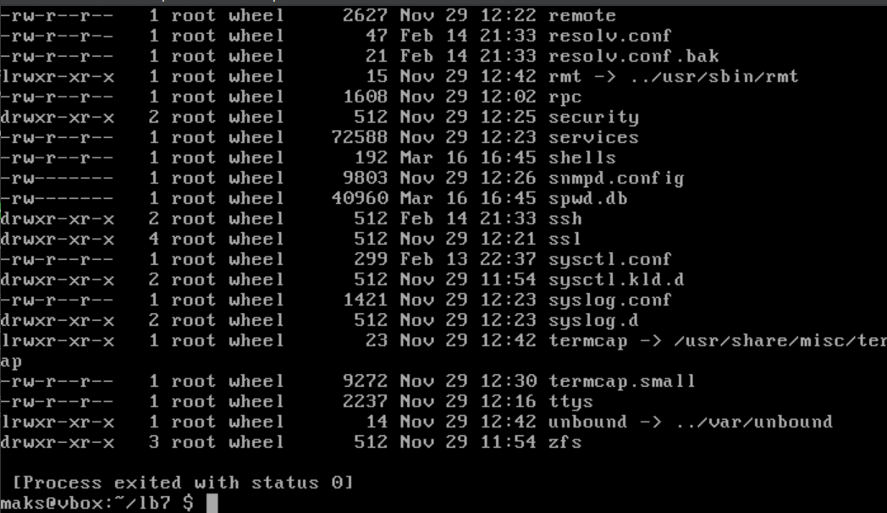

## Завдання 2
В цьому завданні ми повинні імітувати команду ```ls -l```. Спочатку просто введемо цю команду в термінал:

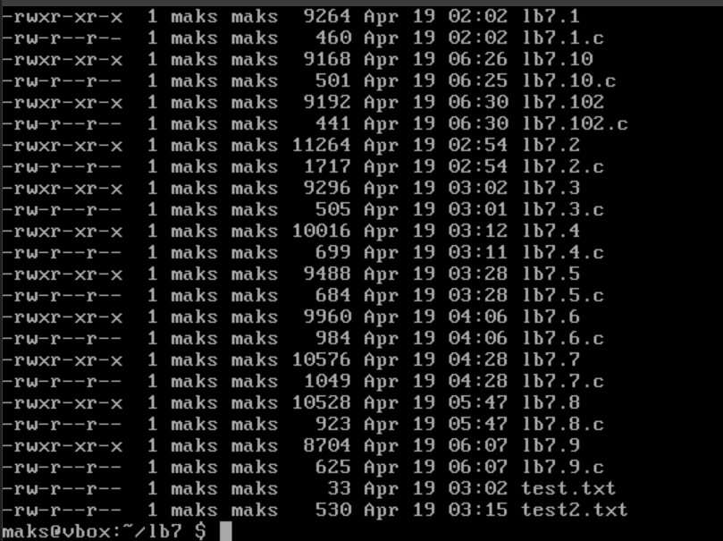

Тепер напишемо програму, яка зможе імітувати цей вивід:
```c
#include <stdio.h>
#include <stdlib.h>
#include <dirent.h>
#include <sys/stat.h>
#include <unistd.h>
#include <pwd.h>
#include <grp.h>
#include <time.h>
#include <string.h>

void print_permissions(mode_t mode){
	if (S_ISREG(mode)) printf("-");
	else if (S_ISDIR(mode)) printf("d");
	else if (S_ISLNK(mode)) printf("l");
	else if (S_ISCHR(mode)) printf("c");
	else if (S_ISBLK(mode)) printf("b");
	else if (S_ISFIFO(mode)) printf("p");
	else if (S_ISSOCK(mode)) printf("s");
	else printf("?");

	printf((mode & S_IRUSR) ? "r" : "-");
	printf((mode & S_IWUSR) ? "w" : "-");
	printf((mode & S_IXUSR) ? "x" : "-");
	printf((mode & S_IRGRP) ? "r" : "-");
	printf((mode & S_IWGRP) ? "w" : "-");
	printf((mode & S_IXGRP) ? "x" : "-");
	printf((mode & S_IROTH) ? "r" : "-");
	printf((mode & S_IWOTH) ? "w" : "-");
	printf((mode & S_IXOTH) ? "x" : "-");
}

int main(){
	DIR *dir;
	struct dirent *entry;
	struct stat file_stat;
	
	dir = opendir(".");
	if (!dir){
		perror("opendir");
		return 1;
	}

	while ((entry = readdir(dir)) != NULL){
		if (strcmp(entry->d_name, ".") == 0 || strcmp(entry->d_name, "..") == 0)
			continue;
	
		if(stat(entry->d_name, &file_stat) == -1){
			perror("stat");
			continue;
		}

		print_permissions(file_stat.st_mode);
		printf(" %ld", (long)file_stat.st_nlink);
	
		struct passwd *pw = getpwuid(file_stat.st_uid);
		struct group *gr = getgrgid(file_stat.st_uid);
	
		printf(" %s", pw ? pw->pw_name :"?");
		printf(" %s", gr ? gr ->gr_name :"?");
		printf(" %5ld", (long)file_stat.st_size);

		char timebuf[80];
		strftime(timebuf, sizeof(timebuf), "%b %d %H:%M", localtime(&file_stat.st_mtime));
		printf(" %s", timebuf);
	
		printf(" %s\n", entry->d_name);
	
	}
	closedir(dir);
	return 0;
}
```
Вивід:
[output 2](images/7.2.1.png.)

Як бачимо, програма чудово імітує команду ```ls -l``` тому що в ній ми використовували системні виклики POSIX (```opendir```, ```readdir```, ```stat```).

## Завдання 3
В цьому завданні нам потрібно написавти свою програму, яка імітує ```grep```. Спочатку продемонтруємо, як використовувать саму команду. Для цього створимо окремий [текстовий файл](test.txt) з набором слів.

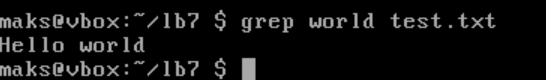

Команда шукає в тексті слово та зчитує рядок із цим словом. Тепер напишемо подібну програму:

```c
#include <stdio.h>
#include <stdlib.h>
#include <string.h>

#define MAX_LINE 1024

int main(int argc, char *argv[]){
	if (argc != 3){
		fprintf(stderr, "Usage: %s <word> <filename>\n", argv[0]);
		return 1;
	}

	const char *word = argv[1];
	const char *filename = argv[2];

	FILE *file = fopen(filename, "r");
	if (!file){
		perror("fopen");
		return 1;
	}

	char line[MAX_LINE];
	while(fgets(line, sizeof(line), file)){
		if(strstr(line,word)){
			printf("%s",line);
		}
	}

	fclose(file);
	return 0;
}
```
Вивід:

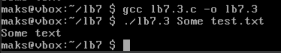

Програма чудово справляється з імітацією команди ```grep```.

## Завдання 4
Тепер нам потрібно програмою імітувати команду ```more```. Аналогічно створюємо [текстовий файл](test2.txt) і перевіряємо саму команду:

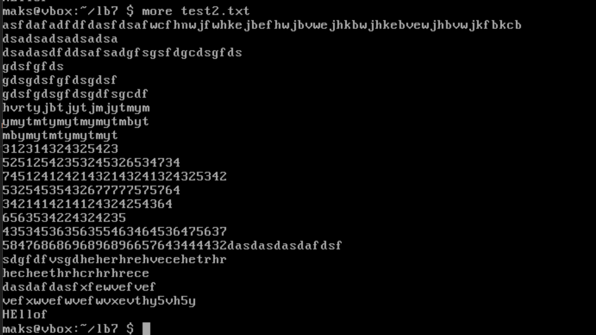

Тепер створюэмо програму, яка буде імітувати цю команду:

```c
#include <stdio.h>
#include <stdlib.h>

#define PAGE_SIZE 20

void wait_for_key(){
	printf("-Press Enter to continue-");
	while(getchar() != '\n');
}

void show_file(const char *filename){
	FILE *file = fopen(filename, "r");
	if (!file){
		perror(filename);
		return;
	}

	char line[1024];
	int count = 0;

	while(fgets(line, sizeof(line), file)){
		printf("%s", line);
		count++;
	
		if (count == PAGE_SIZE){
			wait_for_key();
			count = 0;
		}
	}

	fclose(file);
}

int main(int argc, char *argv[]){
	if(argc < 2){
		fprintf(stderr, "Usage: %s file1 [file2...]\n", argv[0]);
		return 1;
	}

	for (int i = 1;i < argc;i++){
		printf("====%s====\n",argv[i]);
		show_file(argv[i]);
	}
	return 0;
}
```
Компілюємо і запускаємо:

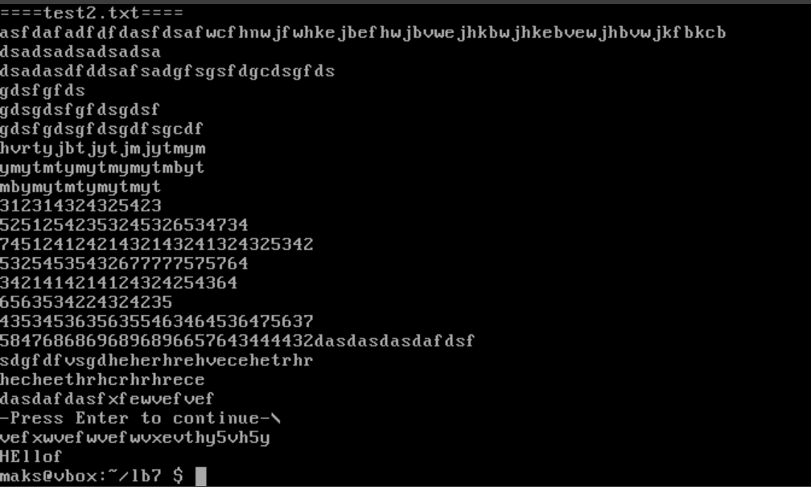

Програма зупиняється кожні 20 рядків текстового файлу і просить натиснути enter щоб продовжити вивід вмісту.

## Завдання 5
Потрібно написати програму, яка перелічує всі файли в поточному каталозі та всі файли в підкаталогах. 
```c
#include <stdio.h>
#include <stdlib.h>
#include <string.h>
#include <dirent.h>
#include <sys/stat.h>
#include <unistd.h>

void list_dir(const char *path){
	struct dirent *entry;
	DIR *dp = opendir(path);
	
	if(dp == NULL){
		perror(path);
		return;
	}

	while ((entry = readdir(dp)) != NULL){
		if(strcmp(entry->d_name, ".") == 0 || strcmp(entry->d_name, "..") == 0)
			continue;

		char fullpath[1024];
		snprintf(fullpath, sizeof(fullpath), "%s/%s", path, entry->d_name);

		printf("%s\n", fullpath);

		struct stat statbuf;
		if (stat(fullpath, &statbuf) == 0 && S_ISDIR(statbuf.st_mode)){
			list_dir(fullpath);
		}
	}
	closedir(dp);
}

int main(){
	list_dir(".");
	return 0;
}
```
Вивід:

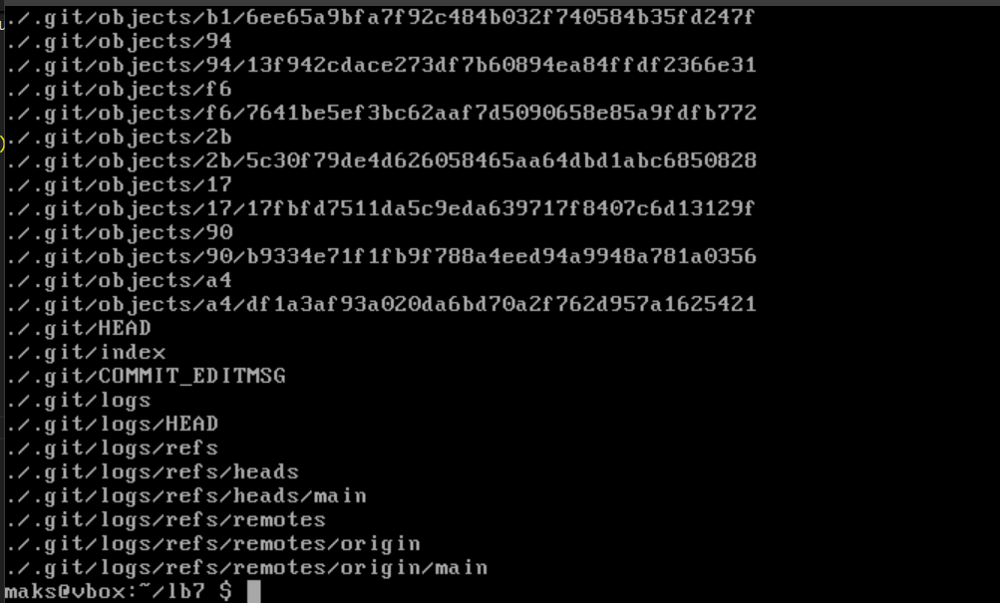

Вивід в cygwin(для кращого вигляду):

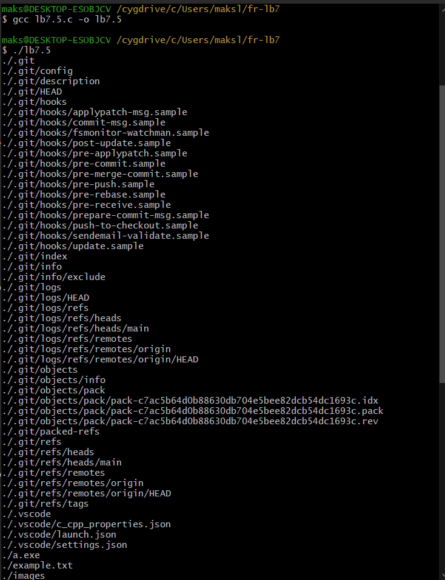

## Завдання 6
Потрібно написати програму, яка виводить лише підкаталоги поточного каталогу у алфавітному порядку.

```c
#include <stdio.h>
#include <stdlib.h>
#include <string.h>
#include <dirent.h>
#include <sys/stat.h>
#include <unistd.h>

#define MAX_ENTRIES 1024

int is_directory(const char *name){
	struct stat st;
	return (stat(name, &st) == 0 && S_ISDIR(st.st_mode));
}

int compare(const void *a, const void *b){
	return strcmp(*(const char **)a, *(const char **)b);
}

int main(){
	DIR *dp;
	struct dirent *entry;
	char *subdirs[MAX_ENTRIES];
	int count = 0;

	dp = opendir(".");
	if (dp == NULL){
		perror("opendir");
		return 1;
	}

	while ((entry = readdir(dp)) != NULL){
		if (entry->d_type == DT_DIR){
			if(strcmp(entry->d_name, ".") == 0 || strcmp(entry->d_name, "..") == 0)
				continue;
			subdirs[count++] = strdup(entry->d_name);
			if(count >= MAX_ENTRIES)
				break;
		}
	}
	closedir(dp);

	qsort(subdirs, count, sizeof(char *), compare);

	printf("Subdirectories (sorted):\n");
	for (int i = 0;i < count;i++){
		printf("%s\n", subdirs[i]);
		free(subdirs[i]);
	}
	return 0;
}
```

Створив для цього завдання 2 папки: першу назвав example а іншу - Axample:

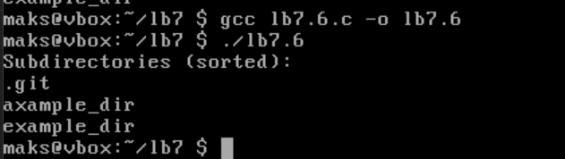

Але всеодно спочатку буде папка, яка починається з символа.

## Завдання 7
В цьому завданні на потрібно написавти програму, яка знаходить усі виконувані файли створені користувачем і яка питає користувача про надавання доступу для читання.

```c
#include <stdio.h>
#include <stdlib.h>
#include <string.h>
#include <dirent.h>
#include <sys/stat.h>
#include <unistd.h>
#include <ctype.h>

int is_executable_file(const char *filename){
	struct stat st;
	if (stat(filename, &st) != 0)
		return 0;
	return (st.st_mode & S_IXUSR) && S_ISREG(st.st_mode);
}

void ask_and_grant(const char *filename){
	char response[10];
	printf("File: %s - open for writing? (y/n)", filename);
	if (fgets(response, sizeof(response), stdin)){
		if (tolower(response[0]) == 'y'){
			if (chmod(filename, S_IRUSR | S_IWUSR | S_IXUSR | S_IRGRP | S_IROTH | S_IXGRP | S_IXOTH) == 0){
				printf("Allowed for reading %s\n", filename);
			}
			else{
				perror("chmod");
			}
		}
		else{
			printf("Skiped: %s\n", filename);
		}
	}
}

int main(){
	DIR *dp;
	struct dirent *entry;
	
	dp = opendir(".");
	if (!dp){
		perror("opendir");
		return 1;
	}

	while ((entry = readdir(dp)) != NULL){
		if (entry->d_type == DT_REG && is_executable_file(entry->d_name)){
			ask_and_grant(entry->d_name);
		}
	}

	closedir(dp);
	return 0;
}
```

Спочатку виберемо файл та закриємо для нього доступ до читання(Наприклад, ```lb7.1```):

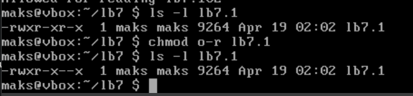

Тепер запустимо нашу програму і дозволемо читання:

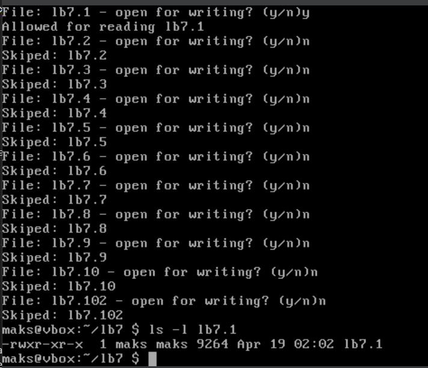

Як бачимо, програма знову надала доступ до читання файлу ```lb7.1```.

## Завдання 8
Потрібно написати програму, яка запитує у користувача, перелічує всі файли в поточному каталозі та чи хоче користувач видалити кожен із них:

```c
#include <stdio.h>
#include <stdlib.h>
#include <string.h>
#include <dirent.h>
#include <unistd.h>
#include <sys/stat.h>
#include <ctype.h>

int is_regular_file(const char *path){
	struct stat st;
	return (stat(path, &st) == 0) && S_ISREG(st.st_mode);
}

void ask_and_delete(const char *filename){
	char response[10];
	printf("Delete file \"%s\"? (y/n): ",filename);
	if (fgets(response, sizeof(response),stdin)){
		if (tolower(response[0]) == 'y'){
			if(remove(filename) == 0){
				printf("Deleted: %s\n", filename);
			}
			else{
				perror("Error during deleting");
			}
		}
		else{
			printf("Skiped %s\n", filename);
		}
	}
}

int main(){
	DIR *dp;
	struct dirent *entry;
	
	dp = opendir(".");
	if (!dp){
		perror("opendir");
		return 1;
	}

	while ((entry = readdir(dp)) != NULL){
		if (entry->d_type == DT_REG || is_regular_file(entry->d_name)){
			ask_and_delete(entry->d_name);
		}
	}
	closedir(dp);
	return 0;
}
```

Створимо, напкрилад, ```example.txt``` і видалимо через програму:

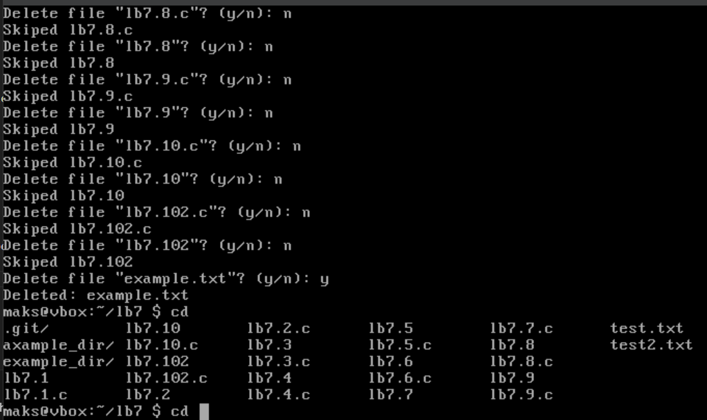

Як бачимо, текстовий файл було видаленно успішно.
 
## Завдання 9
Потрібно написати програму, яка вимірює час виконання фрагмента коду в мілісекундах:

```c
#include <stdio.h>
#include <time.h>

long time_diff_ms(struct timespec start, struct timespec end){
	long seconds = end.tv_sec - start.tv_sec;
	long nanoseconds = end.tv_nsec - start.tv_nsec;
	
	if(nanoseconds < 0){
		seconds -= 1;
		nanoseconds += 1000000000;
	}
	return seconds * 1000 + nanoseconds / 1000000;
}

int main(){
	struct timespec start, end;

	clock_gettime(CLOCK_MONOTONIC, &start);

	volatile long sum = 0;
	for (long i = 0;i < 100000000;i++){
		sum += i;
	}

	clock_gettime(CLOCK_MONOTONIC, &end);
	
	long elapsed_ms = time_diff_ms(start, end);
	printf("Elapsed time: %ld ms\n", elapsed_ms);

	return 0;
}
```

Вивід:

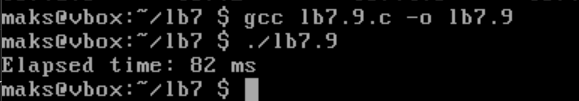

Програма порахувала правильно (я звірився з секундоміром😍)

## Завдання 10
Потрібно написати програму мовою C для створення послідовності випадкових чисел з плаваючою комою у діапазонах:
 (a) від 0.0 до 1.0
 (b) від 0.0 до n, де n — будь-яке дійсне число з плаваючою точкою.

```c
#include <stdio.h>
#include <stdlib.h>
#include <time.h>

float random_0_to_1(){
	return (float)rand() / (float)RAND_MAX;
}

float random_0_to_n(float n){
	return random_0_to_1() *n;
}

int main(){
	srand((unsigned int)time(NULL));

	int count = 10;
	float n = 5.0;

	printf("Rand num[0.0, 1.0]:\n");
	for (int i = 0;i < count;++i){
		printf("%.6f\n",random_0_to_1());
	}

	printf("\n Random num[0.0, %.2f]:\n",n);
	for (int i = 0;i < count;++i){
		printf("%.6f\n",random_0_to_n(n));
	}
	return 0;
}
```

За допомогою ```srand(time)``` генерую кожний раз унікальний сід, за `n` взяв число 5.0; Компілюємо через ```-Wall``` і запускаємо:

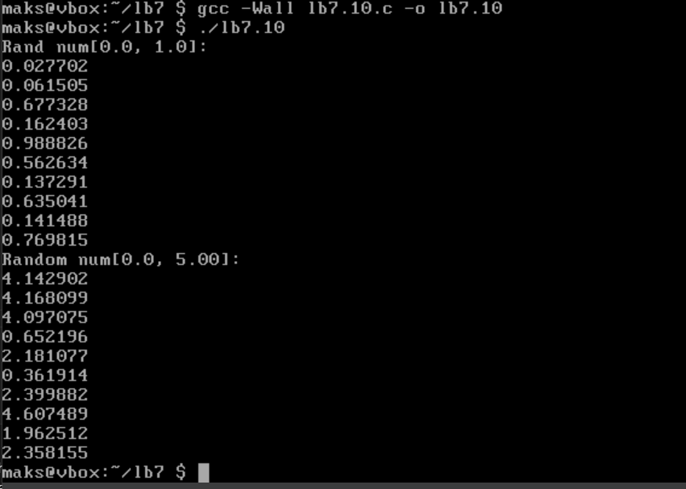

## Завдання по варіанту (10)

В цьому завданні мені потрібно створити утиліту, яка виводить таблицю відкритих файлів усіх процесів у системі без доступу до /proc.
Для цього я перейшов на linux mint, щоб подивитись, як працює ```/proc```:

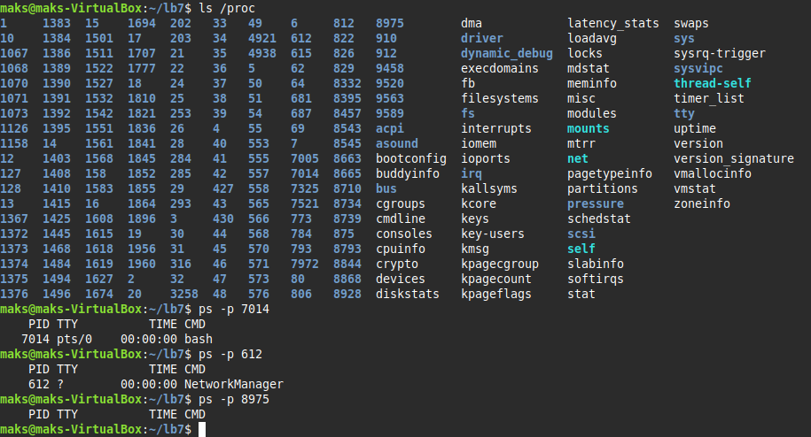

[Тобто](https://www.geeksforgeeks.org/proc-file-system-linux/), ```/proc``` - це віртуальна файлова система Linux, яка надає інтерфейс до внутрішніх структур ядра. На фото можна побачити кожен процес у системі, представлений як директорія ```/proc/<PID>```.

Для того, аби імітувати цю команду на лінуксі, я використав [psutil](https://www.geeksforgeeks.org/psutil-module-in-python/) бібліотеку на пайтоні:

```python
import psutil

def list_open_files():
    print(f"{'PID':<8} {'Process Name':<25} {'Open File'}")
    print("-" * 80)

    for proc in psutil.process_iter(['pid', 'name']):
        try:
            files = proc.open_files()
            for file in files:
                print(f"{proc.pid:<8} {proc.info['name']:<25} {file.path}")
        except (psutil.AccessDenied, psutil.NoSuchProcess):
            continue

if __name__ == "__main__":
    list_open_files()
```

Ввивід:

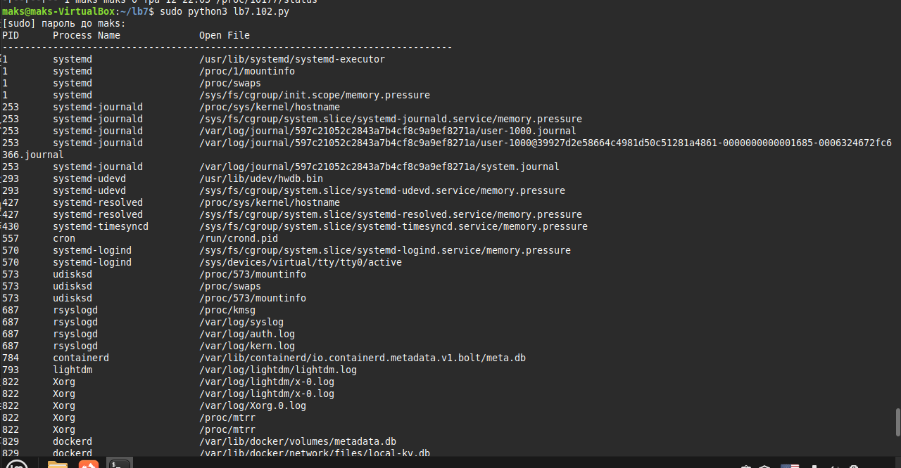

Тобто, моя програма отримує список процесів, читає їх відкриті файли через ```procfs``` і виводить таблицю з PID, іменем процесу та шляхами до відкритих файлів.